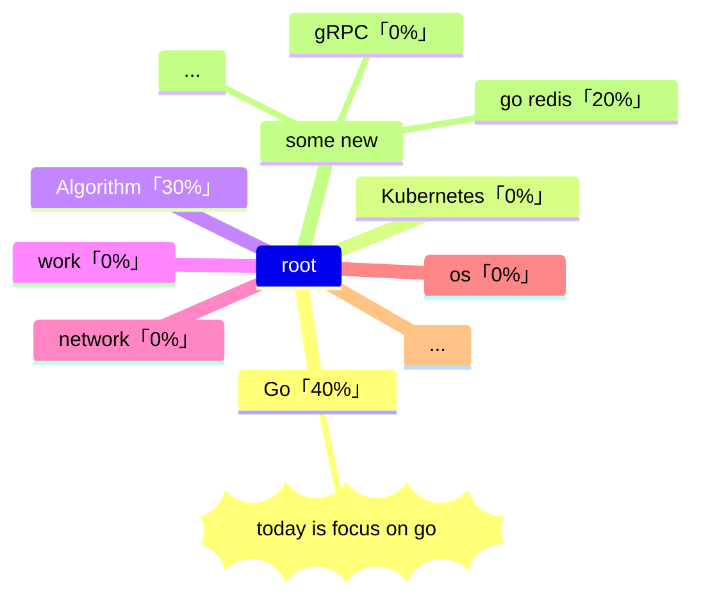

# 2023-05-29-daily-note

<!--more-->



## 规划区

vscode use `alt` + `c` to mark done

-- 昨天遗留 --

- [ ]  「golang - 1h30m」golang GMP 模型
- [ ]  「kubernetes」整理 kubernetes 相关学习内容
- [ ]  「golang」 context
- [ ] 粗读：[Changkun Ou | Go 语言原本](https://golang.design/under-the-hood/)
- [ ] 粗读：[Go 程序员面试笔试宝典 | Go 程序员面试笔试宝典](https://golang.design/go-questions/)
- [ ] 如果还有时间，看下：[6455. 使所有字符相等的最小成本](https://leetcode.cn/problems/minimum-cost-to-make-all-characters-equal/)
- [x] 重新规划博客关于 Golang 相关系列

-- 新计划 --

- [ ] 粗度：[Go 语言设计与实现 | Go 语言设计与实现](https://draveness.me/golang/)

-- 明天 --

## 记录区-习惯记录

- [ ] [算法每日一题](https://honghuiqiang.com/algo/3.%E5%85%B6%E4%BB%96%E8%AE%B0%E5%BD%95/202305270227%20%E6%AF%8F%E6%97%A5%E4%B8%80%E9%A2%98/)
- [ ] 英语
  - [ ] 单词
  - [ ] 口语

## 记录区-重要事记

## 记录区-随手记

今天看到一篇挺有意思的文章：[Money Oriented Programming | 面向金钱的编程](https://wiki.c2.com/?MoneyOrientedProgramming)

## 记录区-总结

心情打分：

- [ ] 😆 很快乐
- [ ] 🙂 一般快乐
- [ ] 😶 无明显情绪波动
- [ ] 🧐有疑问
- [ ] 😵‍💫 很混乱
- [ ] 😮‍💨叹气
- [ ] 😡 生气

**`输出内容`**：（这部分应该是必须的！后续如果想要使用艾宾浩斯方法来回顾，这里会是一个很好的入口）

