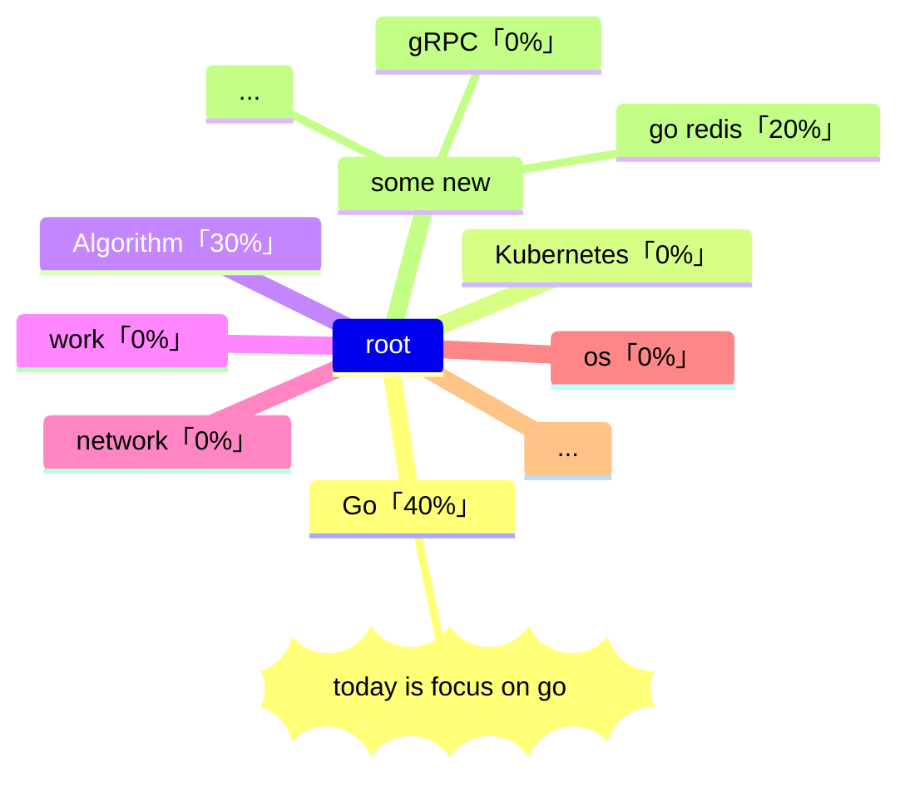

# 「归档」2023-05-daily-notes

<!--more-->



## 2023-05-31

### 规划区

vscode use `alt` + `c` to mark done

- [ ] 2023 年 5 月份日记录归档

### 记录区-习惯记录

- [ ] [算法每日一题](https://honghuiqiang.com/algo/3.%E5%85%B6%E4%BB%96%E8%AE%B0%E5%BD%95/202305270227%20%E6%AF%8F%E6%97%A5%E4%B8%80%E9%A2%98/)
- [ ] 英语
  - [ ] 单词
  - [ ] 口语

### 记录区-重要事记

### 记录区-随手记

### 记录区-总结

心情打分：

- [ ] 😆 很快乐
- [ ] 🙂 一般快乐
- [ ] 😶 无明显情绪波动
- [ ] 🧐有疑问
- [ ] 😵‍💫 很混乱
- [ ] 😮‍💨叹气
- [ ] 😡 生气

**`输出内容`**：（这部分应该是必须的！后续如果想要使用艾宾浩斯方法来回顾，这里会是一个很好的入口）

## 2023-05-30

### 规划区

vscode use `alt` + `c` to mark done

-- 昨天遗留 --

- [ ] 粗读 kubernetes 官方文档 - 概念：[概念 | Kubernetes概念 | Kubernetes](https://kubernetes.io/zh-cn/docs/concepts/)
  - [x] 概述
  - [x] 架构
  - [x] 容器
  - [x] 工作负载
  - [x] 服务、负载均衡
  - [x] 存储
  - [x] 配置
  - [x] 安全
  - [ ] ~~策略~~
  - [ ] 调度、抢占、驱逐
  - [ ] 集群管理

-- 新计划 --

- [x] 粗读计算机网络：https://tobebetterjavaer.com/sidebar/sanfene/network.html

-- 明天 --

- [ ] 整理 5 月份日记录，写月记录

### 记录区-习惯记录

- [x] [算法每日一题](https://honghuiqiang.com/algo/3.%E5%85%B6%E4%BB%96%E8%AE%B0%E5%BD%95/202305270227%20%E6%AF%8F%E6%97%A5%E4%B8%80%E9%A2%98/)
- [ ] 英语
  - [x] 单词
  - [ ] 口语

### 记录区-重要事记

### 记录区-随手记

- "that was a joke, it's funny, because it's true." -- The Big Bang Theory

- 写写字：

      

- 为了避免在粗读网页的时候频繁切到笔记区（通常记不到几个字），使用 `hypothesis` 插件来标注句子或者添加注解

- [皮格马利翁效应 - 维基百科，自由的百科全书](https://zh.wikipedia.org/wiki/%E7%9A%AE%E6%A0%BC%E9%A9%AC%E5%88%A9%E7%BF%81%E6%95%88%E5%BA%94)


- 有意思的画图方式：

    ```text

    ┌─────────────────────────┐
    │                         │
    │ ┌───────┐    ┌────────┐ │
    │ │  CO   │    │ Node   │ │
    │ │       ├────► Plugin │ │
    │ └───────┘    └────────┘ │
    │                         │
    └─────────────────────────┘

    +---------+       +---------+                                      
    | flow1   |------->  flow2  |                                      
    +---------+       +---------+     

    ```

- “那些讲大道理的人都是光正伟岸的，将具体怎么做的人，才是真正愿意帮你的”

### 记录区-总结

心情打分：

- [ ] 😆 很快乐
- [ ] 🙂 一般快乐
- [ ] 😶 无明显情绪波动
- [ ] 🧐有疑问
- [ ] 😵‍💫 很混乱
- [ ] 😮‍💨叹气
- [ ] 😡 生气

## 2023-05-29

### 规划区

vscode use `alt` + `c` to mark done



-- 昨天遗留 --

- [ ]  ~~「golang - 1h30m」golang PMG 模型~~
- [x]  「kubernetes」整理 kubernetes 相关学习内容
- [ ]  ~~「golang」 context~~
- [ ] ~~粗读：[Changkun Ou | Go 语言原本](https://golang.design/under-the-hood/)~~ `写的太复杂，有空闲时间再看看吧`
- [x] 粗读：[Go 程序员面试笔试宝典 | Go 程序员面试笔试宝典](https://golang.design/go-questions/)
- [x] 如果还有时间，看下：[6455. 使所有字符相等的最小成本](https://leetcode.cn/problems/minimum-cost-to-make-all-characters-equal/)
- [x] 重新规划博客关于 Golang 相关系列

-- 新计划 --

- [ ] ~~粗度：[Go 语言设计与实现 | Go 语言设计与实现](https://draveness.me/golang/)~~ `内容有点重复，空闲再看`
- [ ] 粗读 kubernetes 官方文档 - 概念：[概念 | Kubernetes概念 | Kubernetes](https://kubernetes.io/zh-cn/docs/concepts/)
  - [ ] 概述
  - [ ] 架构
  - [ ] 容器
  - [ ] 工作负载
  - [ ] 服务、负载均衡
  - [ ] 存储
  - [ ] 配置
  - [ ] 安全
  - [ ] 策略
  - [ ] 调度、抢占、驱逐
  - [ ] 集群管理


-- 明天 --


### 记录区-习惯记录

- [x] [算法每日一题](https://honghuiqiang.com/algo/3.%E5%85%B6%E4%BB%96%E8%AE%B0%E5%BD%95/202305270227%20%E6%AF%8F%E6%97%A5%E4%B8%80%E9%A2%98/)
- [x] 英语
  - [x] 单词
  - [x] 口语

### 记录区-重要事记

### 记录区-随手记

今天看到一篇挺有意思的文章：[Money Oriented Programming | 面向金钱的编程](https://wiki.c2.com/?MoneyOrientedProgramming)


### 记录区-总结

心情打分：

- [ ] 😆 很快乐
- [ ] 🙂 一般快乐
- [ ] 😶 无明显情绪波动
- [ ] 🧐有疑问
- [ ] 😵‍💫 很混乱
- [ ] 😮‍💨叹气
- [ ] 😡 生气

**`输出内容`**：（这部分应该是必须的！后续如果想要使用艾宾浩斯方法来回顾，这里会是一个很好的入口）

## 2023-05-28

### 规划区

vscode use `alt` + `c` to mark done

-- 昨天遗留 --

- [ ]  「golang - 1h30m」golang GMP 模型
- [ ]  「kubernetes」整理 kubernetes 相关学习内容
- [ ]  「golang」 context

-- 新计划 --

- [x] 整理「算法笔记」专题：[关于 - HHQ算法笔记](https://honghuiqiang.com/algo/)
- [ ] 粗读：[Changkun Ou | Go 语言原本](https://golang.design/under-the-hood/)
- [ ] 粗读：[Go 程序员面试笔试宝典 | Go 程序员面试笔试宝典](https://golang.design/go-questions/)

- [ ] 如果还有时间，看下：[6455. 使所有字符相等的最小成本](https://leetcode.cn/problems/minimum-cost-to-make-all-characters-equal/)

-- 明天 --
- [ ] 粗度：[Go 语言设计与实现 | Go 语言设计与实现](https://draveness.me/golang/)


### 记录区-习惯记录

- [x] [算法每日一题](https://honghuiqiang.com/algo/3.%E5%85%B6%E4%BB%96%E8%AE%B0%E5%BD%95/202305270227%20%E6%AF%8F%E6%97%A5%E4%B8%80%E9%A2%98/)
- [x] 英语
  - [x] 单词
  - [x] 口语

### 记录区-重要事记

### 记录区-随手记

### 记录区-总结

心情打分：

- [ ] 😆 很快乐
- [ ] 🙂 一般快乐
- [ ] 😶 无明显情绪波动
- [ ] 🧐有疑问
- [ ] 😵‍💫 很混乱
- [ ] 😮‍💨叹气
- [ ] 😡 生气

**`输出内容`**：（这部分应该是必须的！后续如果想要使用艾宾浩斯方法来回顾，这里会是一个很好的入口）

## 2023-05-27

### 规划区

vscode use `alt` + `c` to mark done

-- 昨天遗留 --

- [ ]  「golang - 1h30m」golang GMP 模型
- [ ]  「kubernetes」整理 kubernetes 相关学习内容
- [ ]  「golang」 context

-- 新计划 --

- [x] 使用 vscode 一劳永逸吧

### 记录区-习惯记录

- [x] [算法每日一题](https://honghuiqiang.com/algo/3.%E5%85%B6%E4%BB%96%E8%AE%B0%E5%BD%95/202305270227%20%E6%AF%8F%E6%97%A5%E4%B8%80%E9%A2%98/)
- [x] 英语
  - [x] 单词
  - [x] 口语

### 记录区-重要事记

### 记录区-随手记

### 记录区-总结

心情打分：

- [ ] 😆 很快乐
- [ ] 🙂 一般快乐
- [ ] 😶 无明显情绪波动
- [ ] 🧐有疑问
- [ ] 😵‍💫 很混乱
- [ ] 😮‍💨叹气
- [ ] 😡 生气

**`输出内容`**：（这部分应该是必须的！后续如果想要使用艾宾浩斯方法来回顾，这里会是一个很好的入口）

## 2023-05-26

### 规划区

- [x]  「效率」学习、记录流程优化，减少学习、记录之间切换的频繁程度，一方面减少思维转换，另一方面减少浪费的时间，提高效率
- [x]  「golang - 1h」使用 dlv 命令来调试 golang 程序，熟悉新的调试方式中的「流程控制」字符以及界面「输出方式」
- [x]  「golang - 2h」学习 go map 的扩容机制
- [ ]  「golang - 1h30m」golang GMP 模型
- [ ]  「kubernetes」整理 kubernetes 相关学习内容
- [x]  「信息搜索 - 1h」搜索一些kubernetes、计算机网络、操作系统的一些「学习站点」、「面经」
- [ ]  「golang」 context

Tomorrow：
- [ ] nil

### 记录区-习惯记录

(v2.0)打卡状态： ✅   |  ❌ 

<font color=grey>改成使用 todo 列表的形式来表现，每个月的打卡情况在月度总结里面体现</font>

- [x] 算法每日一题
- [216. 组合总和 III](https://leetcode.cn/problems/combination-sum-iii/)
- [547. 省份数量](https://leetcode.cn/problems/number-of-provinces/)
- [1679. K 和数对的最大数目](https://leetcode.cn/problems/max-number-of-k-sum-pairs/)
- [x] 英语
	- [x] 单词
	- [x] 口语


### 记录区-事&物记

- 重要事记

无

- 新事物

### 记录区-随手记
🎧🎵（挑首歌？local:[202305101553 博客音乐嵌入样例](content/posts/life/music/202305101553%20博客音乐嵌入样例.md) remote:[202305101553 博客音乐嵌入样例](http://honghuiqiang.com/202305101553-%E5%8D%9A%E5%AE%A2%E9%9F%B3%E4%B9%90%E5%B5%8C%E5%85%A5%E6%A0%B7%E4%BE%8B/)）

看了[这篇文章](https://www.infoq.cn/article/fMNHfgbHA0UqBlx7k4SD)之后真有感触啊，不太清楚自己到底是不是适合做软件工程这行的工作，「技术总是学不完的」在近期的知识学习中越来越深感自己的无知，技术相关的东西那么多，可能我穷极一生都是学不完的，旧的东西已经很多了，新的东西一直在出来，如果自己一直以学习技术为信条，恐怕永远都只能够这样子，受限于学习技术，而很难有创新。当然，这也并非绝对的，创造也要基于一些基础，知识感觉自己需要流出更多的空间来多思考一些新奇的想法，如果觉得好玩、有意义就去实现它。


学习流程能否优化？


「分类」「系列」「专题」「标签」
现在博客中可以使用分类、系列、标签来归档文章了。


<font color=grey>Goland 2023.1 版本激活：https://blog.idejihuo.com/jetbrains/intellij-idea-2023-1-the-latest-crack-tutorial-permanent-activation-graphic-crack-tutorial.html
</font>

### 记录区-总结

心情打分：
- [ ] 😆 很快乐
- [ ] 🙂 一般快乐
- [x] 😶 无明显情绪波动
- [ ] 🧐有疑问
- [ ] 😵‍💫 很混乱
- [ ] 😮‍💨叹气
- [ ] 😡 生气

**`输出内容`**：（这部分应该是必须的！后续如果想要使用艾宾浩斯方法来回顾，这里会是一个很好的入口）

## 2023-05-25

### 规划区


- [ ] 学习生成 go 的汇编文件，并使用 dlv 来调试
- [x] 回溯算法
- [x] go map 的底层实现


### 记录区-习惯记录

(v2.0)打卡状态： ✅   |  ❌ 

<font color=grey>改成使用 todo 列表的形式来表现，每个月的打卡情况在月度总结里面体现</font>

- [x] 算法每日一题


### 记录区-事&物记

- 重要事记

无

- 新事物

### 记录区-随手记
🎧🎵（挑首歌？local:[202305101553 博客音乐嵌入样例](content/posts/life/music/202305101553%20博客音乐嵌入样例.md) remote:[202305101553 博客音乐嵌入样例](http://honghuiqiang.com/202305101553-%E5%8D%9A%E5%AE%A2%E9%9F%B3%E4%B9%90%E5%B5%8C%E5%85%A5%E6%A0%B7%E4%BE%8B/)）


### 记录区-总结

心情打分：
- [ ] 😆 很快乐
- [ ] 🙂 一般快乐
- [x] 😶 无明显情绪波动
- [ ] 🧐有疑问
- [ ] 😵‍💫 很混乱
- [ ] 😮‍💨叹气
- [ ] 😡 生气

**`输出内容`**：（这部分应该是必须的！后续如果想要使用艾宾浩斯方法来回顾，这里会是一个很好的入口）

- [202305250952 回溯算法](content/posts/box/202305250952%20回溯算法.md)
- [202305251159 Golang 中 map 的实现](content/posts/box/202305251159%20Golang%20中%20map%20的实现.md)


### 记录区-明天

- [ ] 看一下 go map 的扩容机制

## 2023-05-24

### 规划区



gantt
dateFormat HH:mm
axisFormat %H:%M
tickInterval 1h
title 今天大概要做

section 知识交流
	1.整理一个跟阿能交流信息的地方:done, 19:00, 1h
	
section 习惯
	算法每日一题:done, 1h



### 记录区-习惯记录

(v2.0)打卡状态： ✅   |  ❌ 

<font color=grey>改成使用 todo 列表的形式来表现，每个月的打卡情况在月度总结里面体现</font>

- [x] 算法每日一题

- [797. 所有可能的路径](https://leetcode.cn/problems/all-paths-from-source-to-target/) （跟题目： [剑指 Offer II 110. 所有路径](https://leetcode.cn/problems/bP4bmD/) 是一样的）
-  [剑指 Offer II 086. 分割回文子字符串](https://leetcode.cn/problems/M99OJA/)

### 记录区-事&物记

- 重要事记

无

- 新事物

### 记录区-随手记
🎧🎵（挑首歌？local:[202305101553 博客音乐嵌入样例](content/posts/life/music/202305101553%20博客音乐嵌入样例.md) remote:[202305101553 博客音乐嵌入样例](http://honghuiqiang.com/202305101553-%E5%8D%9A%E5%AE%A2%E9%9F%B3%E4%B9%90%E5%B5%8C%E5%85%A5%E6%A0%B7%E4%BE%8B/)）



「**我已经尝到了活在这个世界上的幸福**」


### 记录区-总结

心情打分：
- [ ] 😆 很快乐
- [ ] 🙂 一般快乐
- [ ] 😶 无明显情绪波动
- [ ] 🧐有疑问
- [ ] 😵‍💫 很混乱
- [ ] 😮‍💨叹气
- [ ] 😡 生气

**`输出内容`**：（这部分应该是必须的！后续如果想要使用艾宾浩斯方法来回顾，这里会是一个很好的入口）
- local [202305240057 图的遍历](content/posts/algorithm/202305240057%20图的遍历.md) remote [202305240057 图的遍历](http://honghuiqiang.com/202305240057-%E5%9B%BE%E7%9A%84%E9%81%8D%E5%8E%86)
- local [202305241402 使用值、指针作为方法的参数的一点区别](content/posts/box/202305241402%20使用值、指针作为方法的参数的一点区别.md)


### 记录区-明天

## 2023-05-23

### 规划区



gantt
dateFormat HH:mm
axisFormat %H:%M
tickInterval 1h
title 今天大概要做

section 算法
	1.avl: done, 12:00, 3h
	2.图、基础操作重新整理一下: done, 21:00, 1h
	
section 习惯
	算法每日一题: 1h



### 记录区-习惯记录

(v2.0)打卡状态： ✅   |  ❌ 

<font color=grey>改成使用 todo 列表的形式来表现，每个月的打卡情况在月度总结里面体现</font>

- [ ] 算法每日一题


### 记录区-事&物记

- 重要事记

无

- 新事物

### 记录区-随手记
🎧🎵（挑首歌？local:[202305101553 博客音乐嵌入样例](content/posts/life/music/202305101553%20博客音乐嵌入样例.md) remote:[202305101553 博客音乐嵌入样例](http://honghuiqiang.com/202305101553-%E5%8D%9A%E5%AE%A2%E9%9F%B3%E4%B9%90%E5%B5%8C%E5%85%A5%E6%A0%B7%E4%BE%8B/)）


### 记录区-总结

心情打分：
- [ ] 😆 很快乐
- [ ] 🙂 一般快乐
- [ ] 😶 无明显情绪波动
- [ ] 🧐有疑问
- [ ] 😵‍💫 很混乱
- [ ] 😮‍💨叹气
- [ ] 😡 生气

**`输出内容`**：（这部分应该是必须的！后续如果想要使用艾宾浩斯方法来回顾，这里会是一个很好的入口）
- local [202305222352 平衡二叉搜索树-AVL](content/posts/algorithm/202305222352%20平衡二叉搜索树-AVL.md) remote [202305222352 平衡二叉搜索树-AVL](http://honghuiqiang.com/202305222352-%E5%B9%B3%E8%A1%A1%E4%BA%8C%E5%8F%89%E6%90%9C%E7%B4%A2%E6%A0%91-avl)

### 记录区-明天

## 2023-05-22

### 规划区


gantt
dateFormat HH:mm
axisFormat %H:%M
tickInterval 1h
title 今天大概要做

section 存储
	1.阅读《DDIA》:done,09:00, 2h

section mysql
	1.sql基本语法回顾: done,90m

section 文档迁移
	1. ebs、ecs工作期间的文档: done, 90m
section 习惯
	算法每日一题:done, 1h



### 记录区-习惯记录

(v2.0)打卡状态： ✅   |  ❌ 

<font color=grey>改成使用 todo 列表的形式来表现，每个月的打卡情况在月度总结里面体现</font>

- [x] 算法每日一题


### 记录区-事&物记

- 重要事记

无

- 新事物

### 记录区-随手记
🎧🎵（挑首歌？local:[202305101553 博客音乐嵌入样例](content/posts/life/music/202305101553%20博客音乐嵌入样例.md) remote:[202305101553 博客音乐嵌入样例](http://honghuiqiang.com/202305101553-%E5%8D%9A%E5%AE%A2%E9%9F%B3%E4%B9%90%E5%B5%8C%E5%85%A5%E6%A0%B7%E4%BE%8B/)）

> “普通人活得疲惫而惶恐，一个疲惫而惶恐的人负担不了理想。他必须养家糊口” -- 《漫长的告别》


### 记录区-总结

心情打分：
- [ ] 😆 很快乐
- [ ] 🙂 一般快乐
- [x] 😶 无明显情绪波动
- [ ] 🧐有疑问
- [ ] 😵‍💫 很混乱
- [ ] 😮‍💨叹气
- [ ] 😡 生气

输出内容：


### 记录区-明天


## 2023-05-21

### 规划区



gantt
dateFormat HH:mm
axisFormat %H:%M
tickInterval 1h
title 今天大概要做

section leetcode
	1.周赛: done,10:30, 90m

section 《Go101》
	看完通道相关的内容: done, 3h
	粗读并发编程的其他内容:done, 3h
	粗读《内存相关》的内容:done, 90m

section 博客
	1.整理box的文档:done, 15m

section 习惯
	算法每日一题:done, 1h



### 记录区-习惯记录

(v2.0)打卡状态： ✅   |  ❌ 

<font color=grey>改成使用 todo 列表的形式来表现，每个月的打卡情况在月度总结里面体现</font>

- [x] 算法每日一题


### 记录区-事&物记

- 重要事记

无

- 新事物

### 记录区-随手记
🎧🎵（挑首歌？local:[202305101553 博客音乐嵌入样例](content/posts/life/music/202305101553%20博客音乐嵌入样例.md) remote:[202305101553 博客音乐嵌入样例](http://honghuiqiang.com/202305101553-%E5%8D%9A%E5%AE%A2%E9%9F%B3%E4%B9%90%E5%B5%8C%E5%85%A5%E6%A0%B7%E4%BE%8B/)）


### 记录区-总结

心情打分：
- [ ] 😆 很快乐
- [x] 🙂 一般快乐
- [ ] 😶 无明显情绪波动
- [ ] 🧐有疑问
- [ ] 😵‍💫 很混乱
- [ ] 😮‍💨叹气
- [ ] 😡 生气

输出内容：


### 记录区-明天

## 2023-05-20

### 规划区



gantt
dateFormat HH:mm
axisFormat %H:%M
tickInterval 1h
title 今天大概要做

section golang学习
	4.方法:08:00,1h
	5.接口:done,1h
	6.类型内嵌:done,1h
	7.非类型安全指针:done,1h
	8.泛型:done,1h
	9.反射:done,1h
	10.粗读一下《GO101》的一些专题: done,2h
	11.看完并发编程的内容:4h
section 习惯
	算法每日一题:done, 1h



### 记录区-习惯记录

(v2.0)打卡状态： ✅   |  ❌ 

<font color=grey>改成使用 todo 列表的形式来表现，每个月的打卡情况在月度总结里面体现</font>

- [x] 算法每日一题


### 记录区-事&物记

- 重要事记

无

- 新事物

### 记录区-随手记
🎧🎵（挑首歌？local:[202305101553 博客音乐嵌入样例](content/posts/life/music/202305101553%20博客音乐嵌入样例.md) remote:[202305101553 博客音乐嵌入样例](http://honghuiqiang.com/202305101553-%E5%8D%9A%E5%AE%A2%E9%9F%B3%E4%B9%90%E5%B5%8C%E5%85%A5%E6%A0%B7%E4%BE%8B/)）

“在做什么的时候，都尽力去做，可能过后什么也不记得，但是在做的时候就尽力做到最好”

今天的学习量还不错，继续保持吧


### 记录区-总结

心情打分：
- [ ] 😆 很快乐
- [ ] 🙂 一般快乐
- [ ] 😶 无明显情绪波动
- [ ] 🧐有疑问
- [ ] 😵‍💫 很混乱
- [ ] 😮‍💨叹气
- [ ] 😡 生气

输出内容：


### 记录区-明天

- 整理一下 box 里面的文档

## 2023-05-19

### 规划区



gantt
dateFormat HH:mm
axisFormat %H:%M
tickInterval 1h
title 今天大概要做

section golang类型系统专题学习
	1.字符串:done,07:00,1h
	2.函数:done,1h
	3.通道:done,1h
	4.方法:1h
	5.接口:1h
	6.类型内嵌:1h
	7.非类型安全指针:1h
	8.泛型:1h
	9.反射:1h
	
section 习惯
	算法每日一题:done, 1h



### 记录区-习惯记录

(v2.0)打卡状态： ✅   |  ❌ 

<font color=grey>改成使用 todo 列表的形式来表现，每个月的打卡情况在月度总结里面体现</font>

- [x] 算法每日一题


### 记录区-事&物记

- 重要事记

无

- 新事物

### 记录区-随手记
🎧🎵（挑首歌？local:[202305101553 博客音乐嵌入样例](content/posts/life/music/202305101553%20博客音乐嵌入样例.md) remote:[202305101553 博客音乐嵌入样例](http://honghuiqiang.com/202305101553-%E5%8D%9A%E5%AE%A2%E9%9F%B3%E4%B9%90%E5%B5%8C%E5%85%A5%E6%A0%B7%E4%BE%8B/)）

今天看了比较多 Go 方面的内容，感觉之前的工作中都很少能用到 channel，还是没体会到使用 Go 编程的乐趣

### 记录区-总结

心情打分：
- [ ] 😆 很快乐
- [ ] 🙂 一般快乐
- [ ] 😶 无明显情绪波动
- [ ] 🧐有疑问
- [x] 😵‍💫 很混乱
- [ ] 😮‍💨叹气
- [ ] 😡 生气

输出内容：


### 记录区-明天

## 2023-05-18

### 规划区



gantt
dateFormat HH:mm
axisFormat %H:%M
tickInterval 1h
title 今天大概要做

section 学习
	1.整理一些golang常见问题:done, 09:00, 3h
	2.GO类型系统、结构体等内容学习:done, 3h
	3.channel: 1h
section 习惯
	算法每日一题:done, 1h



### 记录区-习惯记录

(v2.0)打卡状态： ✅   |  ❌ 

<font color=grey>改成使用 todo 列表的形式来表现，每个月的打卡情况在月度总结里面体现</font>

- [x] 算法每日一题


### 记录区-事&物记

- 重要事记

无

- 新事物

### 记录区-随手记
🎧🎵（挑首歌？local:[202305101553 博客音乐嵌入样例](content/posts/life/music/202305101553%20博客音乐嵌入样例.md) remote:[202305101553 博客音乐嵌入样例](http://honghuiqiang.com/202305101553-%E5%8D%9A%E5%AE%A2%E9%9F%B3%E4%B9%90%E5%B5%8C%E5%85%A5%E6%A0%B7%E4%BE%8B/)）


### 记录区-总结

心情打分：
- [ ] 😆 很快乐
- [ ] 🙂 一般快乐
- [x] 😶 无明显情绪波动
- [ ] 🧐有疑问
- [ ] 😵‍💫 很混乱
- [ ] 😮‍💨叹气
- [ ] 😡 生气

输出内容：


### 记录区-明天

## 2023-05-17

### 规划区



gantt
dateFormat HH:mm
axisFormat %H:%M
tickInterval 1h
title 今天大概要做

section 学习
	1.重新梳理一下之前的规划:done, 06:30, 4h
	2.golang学习: done, 3h
section 习惯
	算法每日一题: 1h



### 记录区-习惯记录

(v2.0)打卡状态： ✅   |  ❌ 

<font color=grey>改成使用 todo 列表的形式来表现，每个月的打卡情况在月度总结里面体现</font>

- [ ] 算法每日一题


### 记录区-事&物记

- 重要事记

无

- 新事物

### 记录区-随手记
🎧🎵（挑首歌？local:[202305101553 博客音乐嵌入样例](content/posts/life/music/202305101553%20博客音乐嵌入样例.md) remote:[202305101553 博客音乐嵌入样例](http://honghuiqiang.com/202305101553-%E5%8D%9A%E5%AE%A2%E9%9F%B3%E4%B9%90%E5%B5%8C%E5%85%A5%E6%A0%B7%E4%BE%8B/)）


### 记录区-总结

心情打分：
- [ ] 😆 很快乐
- [ ] 🙂 一般快乐
- [x] 😶 无明显情绪波动
- [ ] 🧐有疑问
- [ ] 😵‍💫 很混乱
- [ ] 😮‍💨叹气
- [ ] 😡 生气

输出内容：


### 记录区-明天

## 2023-05-16

### 规划区



gantt
dateFormat HH:mm
axisFormat %H:%M
tickInterval 1h
title 今天大概要做

section 文档迁移
	b7.openshift文档:done,13:30, 1h
    b8.工作性质的文档: done,4h

section 习惯
	算法每日一题: 1h



### 记录区-习惯记录

(v2.0)打卡状态： ✅   |  ❌ 

<font color=grey>改成使用 todo 列表的形式来表现，每个月的打卡情况在月度总结里面体现</font>

- [ ] 算法每日一题


### 记录区-事&物记

- 重要事记

无

- 新事物

### 记录区-随手记
🎧🎵（挑首歌？local:[202305101553 博客音乐嵌入样例](content/posts/life/music/202305101553%20博客音乐嵌入样例.md) remote:[202305101553 博客音乐嵌入样例](http://honghuiqiang.com/202305101553-%E5%8D%9A%E5%AE%A2%E9%9F%B3%E4%B9%90%E5%B5%8C%E5%85%A5%E6%A0%B7%E4%BE%8B/)）

把之前剩下的没整理的工作内容文档整理了一下

### 记录区-总结

心情打分：
- [ ] 😆 很快乐
- [ ] 🙂 一般快乐
- [ ] 😶 无明显情绪波动
- [x] 🧐有疑问
- [ ] 😵‍💫 很混乱
- [ ] 😮‍💨叹气
- [ ] 😡 生气

输出内容：


### 记录区-明天

## 2023-05-15

## 2023-05-14

## 2023-05-13

### 规划区


- 梳理一下整体要学习的内容？



gantt
dateFormat HH:mm
axisFormat %H:%M
tickInterval 1h
title 今天大概要做


section 文档迁移
	b7.openshift文档:13:00, 1h
    b8.工作性质的文档: 4h

section 博客
	a1.整理我的workspace:1h

section 习惯
	算法每日一题: 1h
	双周赛:22:30, 90m



### 记录区-习惯记录

(v2.0)打卡状态： ✅   |  ❌ 

<font color=grey>改成使用 todo 列表的形式来表现，每个月的打卡情况在月度总结里面体现</font>

- [ ] 算法每日一题


### 记录区-事&物记

- 重要事记

无

- 新事物

### 记录区-随手记
🎧🎵（挑首歌？local:[202305101553 博客音乐嵌入样例](content/posts/life/music/202305101553%20博客音乐嵌入样例.md) remote:[202305101553 博客音乐嵌入样例](http://honghuiqiang.com/202305101553-%E5%8D%9A%E5%AE%A2%E9%9F%B3%E4%B9%90%E5%B5%8C%E5%85%A5%E6%A0%B7%E4%BE%8B/)）


### 记录区-总结

心情打分：
- [ ] 😆 很快乐
- [ ] 🙂 一般快乐
- [ ] 😶 无明显情绪波动
- [ ] 🧐有疑问
- [ ] 😵‍💫 很混乱
- [ ] 😮‍💨叹气
- [ ] 😡 生气

输出内容：


### 记录区-明天

## 2023-05-12

### 规划区


1. 加个评论系统差不多了，博客就差不多这样好了
2. 整理一下我的电脑工作区 

workspace，也就是学习、工作时候的界面布局，还是划分一下大致的区域，养成习惯，整洁一点

3. 整理之前写在本地的文档

把文档迁移到博客的过程中顺便回顾一下笔记的内容，不要单纯复制粘贴

4. 如果还有时间，做一下其他相关知识学习（应该是没有时间）     

gantt：

gantt
dateFormat HH:mm
axisFormat %H:%M
tickInterval 1h
title 今天大概要做

section 博客
    a1.添加评论系统:done, 03:00, 30m
    a2.整理我的workspace: 1h
    a3.google网站收录:done, 1h

section 迁移文档
    b1.golang的文档:done, 1h
    b2.mysql文档:done,  20m
    b3.linux文档:done, 1h
    b4.之前放在收集箱的文档:done, 5m
    b5.项目管理文档:done, 40m
    b6.docker文档:done, 30m
    b7.kubernetes文档:done, 1h
    b7.openshift文档: 1h
    b8.工作性质的文档: 4h

section 习惯
	算法每日一题:done, 1h
         

<font color=grey>**`注意以上《工作性质的文档》`**：因为之前写在本地，所以一些公司隐私性质的内容都卸载里面，放到博客只需要提取其中知识性的内容！</font>


### 记录区-习惯记录

(v2.0)打卡状态： ✅   |  ❌ 

<font color=grey>改成使用 todo 列表的形式来表现，每个月的打卡情况在月度总结里面体现</font>

- [x] 算法每日一题 

	[202305121759 t128 最长连续序列](content/posts/algorithm/leetcode/202305121759%20t128%20最长连续序列.md)


### 记录区-事&物记

- 重要事记

无

- 新事物

发现两本新的书：[操作系统导论](https://book.douban.com/subject/33463930/)、[DDIA](https://github.com/Vonng/ddia/blob/master/part-i.md)


一个高质量的博客：[https://draveness.me/](https://draveness.me/)


### 记录区-随手记
🎧🎵（挑首歌？local:[202305101553 博客音乐嵌入样例](content/posts/life/music/202305101553%20博客音乐嵌入样例.md) remote:[202305101553 博客音乐嵌入样例](http://honghuiqiang.com/202305101553-%E5%8D%9A%E5%AE%A2%E9%9F%B3%E4%B9%90%E5%B5%8C%E5%85%A5%E6%A0%B7%E4%BE%8B/)）




今天把规划要迁移的文档大部分迁移了，也做了一些扩展学习，发现了一些不错的博客、书籍。


### 记录区-总结

心情打分：
- [ ] 😆 很快乐
- [x] 🙂 一般快乐
- [ ] 😶 无明显情绪波动
- [ ] 🧐有疑问
- [ ] 😵‍💫 很混乱
- [ ] 😮‍💨叹气
- [ ] 😡 生气

输出内容：

无（文档迁移）

[202305121500 关于 goroutine 内存泄漏的一些思考](content/posts/go/golang-why/202305121500%20关于%20goroutine%20内存泄漏的一些思考.md)

[202305121926 读 DDIA 留下的一些记录](content/posts/box/202305121926%20读%20DDIA%20留下的一些记录.md)

### 记录区-明天

完成剩下的文档迁移

## 2023-05-11

### 规划区


```
gantt
dateFormat HH:mm
axisFormat %H:%M
tickInterval 1h
title 今天大概要做

section 博客相关内容
1.梳理规划一天的方法、完成日记模板的创建:done,riji,06:00, 2h
2.完成博客的自动发布系统:done,fabu, after riji, 1h
3.总结文档《使用huog+github pages搭建博客流程》:done,after fabu, 90m
4.golang: 1h

section 习惯
算法每日一题:done, 1h
```

gantt（最后要与上面的代码同步）：

gantt
dateFormat HH:mm
axisFormat %H:%M
tickInterval 1h
title 今天大概要做

section 博客相关内容
1.梳理规划一天的方法、完成日记模板的创建:done,riji,06:00, 2h
2.完成博客的自动发布系统:done,fabu, after riji, 1h
3.总结文档《使用huog+github pages搭建博客流程》:done,after fabu, 90m
4.golang: 1h 

section 习惯
算法每日一题:done, 1h



### 记录区-习惯记录

打卡状态： ✅   |  ❌

|日期|算法|阅读|
|-|-|-|
|1|✅||
|2|✅||
|3|✅||
|4|✅||
|5|✅||
|6|✅||
|7|||
|8|✅||
|9|||
|10|||
|11|✅||
|12|✅||
|13|||
|14|||
|15|||
|16|||
|17|||
|18|||
|19|||
|20|||
|21|||
|22|||
|23|||
|24|||
|25|||
|26|||
|27|||
|28|||
|29|||
|30|||
|31|||


### 记录区-事&物记

- 重要事记

无

- 新事物

GitHub Action， 类似于之前工作上的 cdp 的东西

### 记录区-随手记
🎧🎵（挑首歌？local:[202305101553 博客音乐嵌入样例](content/posts/life/music/202305101553%20博客音乐嵌入样例.md) remote:[202305101553 博客音乐嵌入样例](http://honghuiqiang.com/202305101553-%E5%8D%9A%E5%AE%A2%E9%9F%B3%E4%B9%90%E5%B5%8C%E5%85%A5%E6%A0%B7%E4%BE%8B/)）

不管什么时间点都适合听这歌 Lessang yyds：


”

我的人生为什么这样，这些都是借口

不要轻易放弃人生这场游戏

在这世上长眠之时毫无留恋

最后，让幸福的大门能够开启

找寻幸福飞了一会

让所有萎靡都能重拾笑容


“


昨天要完成的工作大体完成了，期间有碰到了一点问题，关于 git lfs 以及 gh pages 域名配置的问题，不过也都顺利解决掉了，本来把 Golang 学习放在晚上，不过太困了很早就睡了，搞得现在就醒了（after day 02:03）...不过也睡不着了，起来写一下昨天没写完的记录区（肚子好饿...😵‍💫）


### 记录区-总结

心情打分：
- [ ] 😆 很快乐
- [x] 🙂 一般快乐
- [ ] 😶 无明显情绪波动
- [ ] 🧐有疑问
- [ ] 😵‍💫 很混乱
- [ ] 😮‍💨叹气
- [ ] 😡 生气

输出内容：

1. 日计划

local：[202305110405 怎么来规划一天、做日记录](content/posts/tools/202305110405%20怎么来规划一天、做日记录.md)


2. 博客自动发布

local：[202305110815 使用 GitHub Action 来完成博客自动更新](content/posts/tools/202305110815%20使用%20GitHub%20Action%20来完成博客自动更新.md)

remote：[202305110815 使用 GitHub Action 来完成博客自动更新](http://honghuiqiang.com/202305110815-%E4%BD%BF%E7%94%A8-github-action-%E6%9D%A5%E5%AE%8C%E6%88%90%E5%8D%9A%E5%AE%A2%E8%87%AA%E5%8A%A8%E6%9B%B4%E6%96%B0)


3. 总结了一下博客搭建的过程

local：[202305111342 使用 Hugo + GitHub Pages 搭建博客记录](content/posts/tools/202305111342%20使用%20Hugo%20+%20GitHub%20Pages%20搭建博客记录.md)


4. 算法每日一题

local：[202305111537 t1016 子串能表示从 1 到 N 数字的二进制串](content/posts/algorithm/leetcode/202305111537%20t1016%20子串能表示从%201%20到%20N%20数字的二进制串.md)


### 记录区-明天

1. 明天加个评论系统差不多了，博客就差不多这样好了
2. 整理一下我的电脑工作区 

workspace，也就是学习、工作时候的界面布局，还是划分一下大致的区域，养成习惯，整洁一点

3. 整理之前写在本地的文档

把文档迁移到博客的过程中顺便回顾一下笔记的内容，不要单纯复制粘贴

4. 如果还有时间，做一下其他相关知识学习（应该是没有时间）

