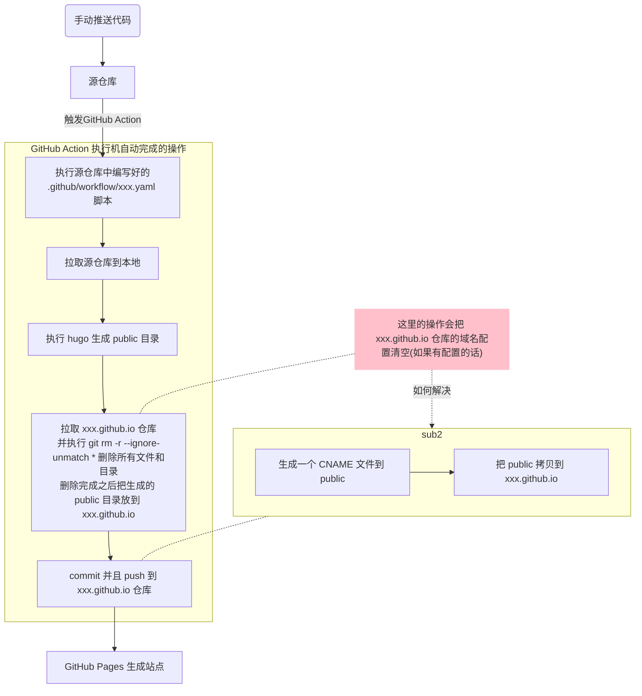

# 使用 GitHub Action 来完成博客自动更新

<!--more-->
#个人记录 

## 手动发布流程

以`编写一篇文档为例`：

1.  使用 obsidian 编写文档
2.  执行命令行本地生成 hugo 页面，看看有没有报错、文档编排之类的问题

```sh
hugo server -e production --disableFastRender
```

3.  如果没有问题，需要把相应内容推送到两个仓库：保存md文档的[仓库A](https://github.com/904566722/study-blog)（本仓库）、保存hugo生成的静态页面的[仓库B](https://github.com/904566722/904566722.github.io)
    
    可以先推送到仓库A，保存文章 然后执行 hugo 生成静态网页，切到 public 目录，推送内容到仓库B
    
```sh
git add .
git commit -m "m/w. desc"
git push

hugo
cd public
git add .
git commit -m "m/w. desc"
git push
```


## 自动发布的过程

需要使用到
- [GitHub Action](https://github.com/features/actions)

一段描述：

使用 GitHub Actions 直接在您的存储库中自动化、自定义和执行您的软件开发工作流程。您可以发现、创建和共享操作以执行您喜欢的任何工作，包括 CI/CD，并在完全自定义的工作流中组合操作

那么就可以用来省去手动到 public 目录 commit、push 的操作，实现博客的自动发布。
设定两个事件就差不多了：
- 当仓库 A 有代码更新（push），执行脚本
- 定时执行脚本
- 支持手动执行




flowchart TD
%% 重要性的分类
classDef important stroke:red, stroke-width:2px
classDef pass stroke:grey, stroke-dasharray: 5,5
%% 流程的分类
classDef success stroke:green
%% 解释
classDef stick fill:yellow, stroke:yellow
classDef stickImp fill:pink, stroke:pink


%% ----主要流程 begin ----
act1(手动推送代码)-->repoA[源仓库]
repoA-->|触发GitHub Action|ga[执行源仓库中编写好的<br>.github/workflow/xxx.yaml 脚本]

subgraph sub1["GitHub Action 执行机自动完成的操作"]
ga-->autoAct1[拉取源仓库到本地]
autoAct1-->autoAct2[执行 hugo 生成 public 目录]
autoAct2-->autoAct3[拉取 xxx.github.io 仓库<br>并执行 git rm -r --ignore-unmatch * 删除所有文件和目录<br>删除完成之后把生成的 public 目录放到 xxx.github.io]
autoAct3-->auto4[commit 并且 push 到 xxx.github.io 仓库]
end


auto4-->page[GitHub Pages 生成站点]

%% ---- 主要流程 end ----

    %% 注意一个问题
	note1["这里的操作会把 xxx.github.io 仓库的域名配置清空(如果有配置的话)"]
	note1-.-autoAct3
	
	subgraph sub2
	fix1[生成一个 CNAME 文件到 public]-->a[把 public 拷贝到 xxx.github.io]
	end
    
    note1-.->|如何解决|sub2
    sub2-.-auto4


class note1 stickImp


## 具体操作

1. person token

在 GitHub 个人设置里面 `settings/developer settings` 创建一个 token，这个 token 需要勾选两个权限：`repo` 和 `workflow`


然后到源仓库 `settings` / `Secrets and variables` 中添加一个 `repository variable` 变量


2. 然后在源仓库需要添加一个 yaml 脚本

目录：`.github/workflows/update-blog.yaml` ，脚本内容如下：
```yaml
name: deploy

on: # 表示以下情况发生时触发
    push:
    workflow_dispatch:
    schedule:
        # Runs everyday at 8:00 AM
        - cron: '0 0 * * *'

jobs:
    build:
        runs-on: ubuntu-latest
        steps:
            - name: Checkout
              uses: actions/checkout@v2
              with:
                  submodules: true
                  fetch-depth: 0

            - name: Set up Python
              uses: actions/setup-python@v2
              with:
                  python-version: 3.8
            
            - name: Commit and push if changed
              run: |-
                  git diff
                  git config --global user.email "action@github.com"
                  git config --global user.name "GitHub Action"
                  git add -A
                  git commit -m "ci: update about page (automatically)" || exit 0
                  git push

            - name: Setup Hugo
              uses: peaceiris/actions-hugo@v2
              with:
                  hugo-version: 0.105.0
                  extended: true

            - name: Build Web
              #run: hugo --gc --minify
              run: hugo

            - name: Create CNAME
              run: echo "honghuiqiang.com" > public/CNAME

            - name: Run Pagefind
              run: npm_config_yes=true npx pagefind --source "public"

            - name: Deploy Web
              uses: peaceiris/actions-gh-pages@v3
              with:
                  PERSONAL_TOKEN: ${{ secrets.PERSONAL_TOKEN }} # 上一步中仓库变量的 key
                  EXTERNAL_REPOSITORY: 904566722/904566722.github.io
                  PUBLISH_BRANCH: hugo
                  PUBLISH_DIR: ./public
                  commit_message: ${{ github.event.head_commit.message }}
```

其中 `Create CNAME` 动作是为了解决如下问题：

问题现象：

使用域名 honghuiqiang.com 无法访问到页面（404）

问题产生的原因：

在 904566722.github.io 仓库中，域名的配置是作为仓库中的一个文件存在的，GitHub Action 操作中，把该仓库拉取下来之后会清空目录，这个文件会被清除掉，因此需要多运行一条命令来再次生成域名配置
```
- name: Create CNAME
  run: echo "honghuiqiang.com" > public/CNAME
```


`至此配置就全部完成了！`


来实际看一下一个 push 之后 github 做的动作：

在 Action 选项卡可以看到流程被触发：


进去能够看到执行机完成的命令，具体做了哪些操作


到此一个 Action 就完成了，可以到 xx.github.io 看到有一个相同 commit msg 的提交


到此就完成了博客的自动更新流程
